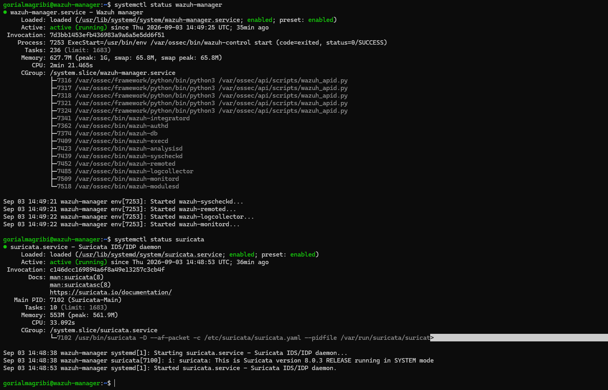
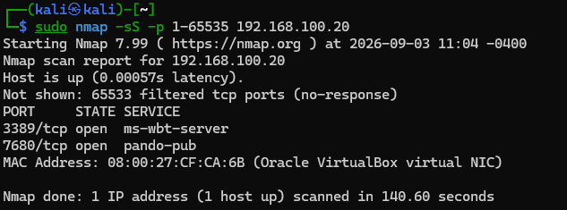
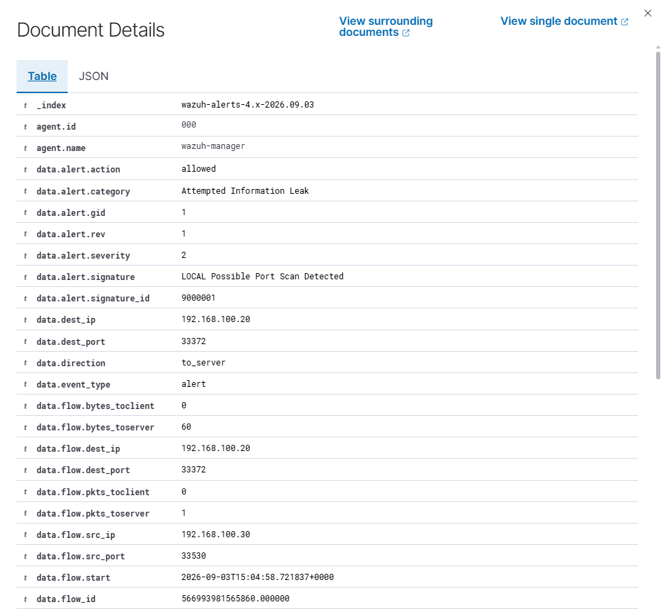
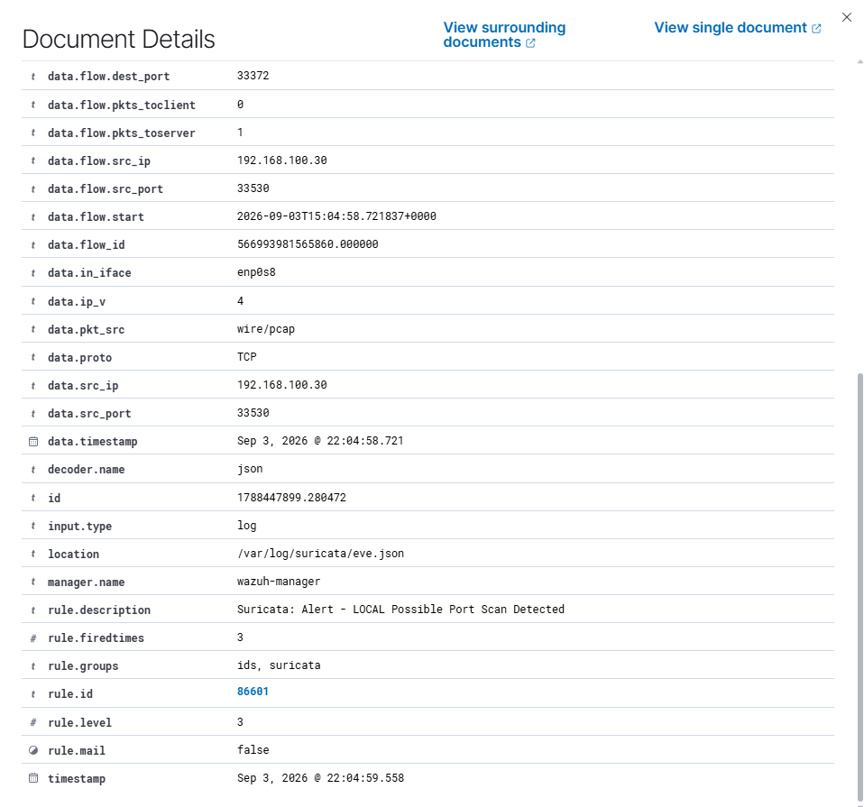

# Port Scan Detection with Suricata NIDS + Wazuh

## Summary

Wazuh, running as a pure HIDS, does not detect network-level reconnaissance like Nmap port scans, since an unanswered SYN packet generates no Windows event log entry. This lab closes that gap by deploying **Suricata as a NIDS** directly on the existing Wazuh Manager, giving the SOC stack visibility into raw network traffic rather than relying solely on host-generated logs. A custom Suricata rule detects SYN-based port scanning and forwards alerts into the Wazuh Dashboard.

## Lab Environment

| **Component** | **OS** | **IP Address (Network: 192.168.100.0/24)** |
| --- | --- | --- |
| Wazuh Manager + Suricata (NIDS) | Ubuntu Server 24.04 LTS | 192.168.100.10 |
| Target Endpoint | Windows 11 Enterprise Evaluation | 192.168.100.20 |
| Attacker (Port scan with Nmap) | Kali Linux 2026.2 | 192.168.100.30 |

Suricata runs on the same host as the Wazuh Manager rather than a dedicated sensor VM, monitoring the `soclab` internal network interface (`enp0s8`) in promiscuous mode. No additional VM was needed to close this detection gap.

## Environment Setup



Install Suricata and confirm both `wazuh-manager` and `suricata` services are active, with Suricata monitoring the `soclab`-facing interface (`enp0s8`) rather than the default `eth0`.

Since the default Emerging Threats Open ruleset has no generic port-scan-detection signature, a custom rule was written and registered in `local.rules`:

```
alert tcp any any -> $HOME_NET any (msg:"LOCAL Possible Port Scan Detected"; flags:S; threshold:type both, track by_src, count 20, seconds 10; sid:9000001; rev:1; classtype:attempted-recon;)
```

This flags any single source IP sending 20+ TCP SYN packets within a 10-second window — the signature of a port scan.

`eve.json` (Suricata's JSON alert output) is registered as a local log source in the Wazuh Manager's own `ossec.conf`:

```jsx
<localfile>
  <log_format>json</log_format>
  <location>/var/log/suricata/eve.json</location>
</localfile>
```

## Attack Simulation



A full-range SYN scan is run from the attacker (Kali) against the target endpoint:

```bash
sudo nmap -sS -p 1-65535 192.168.100.20
```

Two open ports were identified (3389/ms-wbt-server, 7680/pando-pub) out of 65,535 scanned — the scan itself generates well over the 20 SYN packets/10 seconds required to trip the detection rule.

## Detection Query

```jsx
rule.id:86601
```

**Suricata Alert — LOCAL Possible Port Scan Detected (Rule ID 86601)**



Wazuh's built-in Suricata decoder parses `eve.json` and raises the alert under `rule.groups: [ids, suricata]`. Drilling into the raw alert document (below) confirms the full chain: Suricata's own `signature_id: 9000001` (the custom rule) is preserved in `data.alert.signature_id`, alongside the source/destination IPs and the monitored interface (`data.in_iface: enp0s8`) — traceable all the way from the wire to the Wazuh Dashboard.



## **MITRE ATT&CK Mapping**

| ID | Name | Description |
| --- | --- | --- |
| T1046 | Network Service Discovery | Nmap SYN scan used to identify open ports/services on the target host |

## **Remediation**

- Block or rate-limit the attacker's source IP (`192.168.100.30`) at the firewall/network layer.
- Correlate port scan alerts with subsequent activity from the same source IP (e.g. brute-force attempts) to catch multi-stage attacks.
- Tune the `count`/`seconds` threshold if false positives occur from legitimate high-connection-rate services.
- Extend the ruleset to cover other scan types (e.g. `-sU` UDP scans, `-sV` version detection) beyond the SYN scan covered here.
- Consider enabling Suricata's built-in `stream` anomaly detection alongside the custom signature for broader scan-pattern coverage.

## Conclusion

This exercise closes a detection gap identified in an earlier brute-force lab: Wazuh's HIDS architecture cannot see network-level reconnaissance that leaves no host-level log trace. Deploying Suricata as a NIDS directly on the existing Wazuh Manager — with a custom-written detection rule, since the default ruleset had no port-scan signature — restored that visibility without adding a new VM to a RAM-constrained lab. The result is an end-to-end pipeline from raw network traffic to a Wazuh Dashboard alert, and a concrete example of identifying a monitoring blind spot and building the fix rather than working around it.
