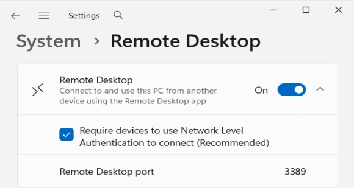
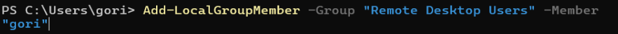
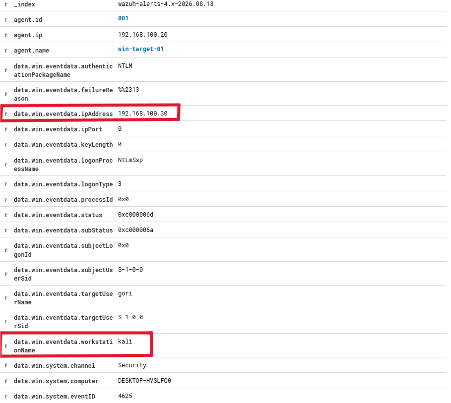

# Brute-Force Attack Detection with Wazuh

## Lab Environment

| **Component** | **OS** | **IP Address (Network: 192.168.100.0/24)** |
| --- | --- | --- |
| Wazuh Manager | Ubuntu Server 24.04 LTS | 192.168.100.10 |
| Target Endpoint | Windows 11 Enterprise Evaluation, RDP enabled | 192.168.100.20 |
| Attacker (Brute force with Hydra) | Kali Linux 2026.2 | 192.168.100.30 |

## Environment Setup



Enable Remote Desktop, as it is disabled by default in Windows 11.



Verify from the attacker’s side (Kali) that the RDP port (3389) is open and ready to accept connections.


Add the user "gori" to the Remote Desktop Users group; without this step, RDP connection attempts will be rejected even if the credentials are correct, because by default only Administrator accounts are allowed remote access.

## Attack Simulation


Once the failure threshold is exceeded, Windows automatically locks the account, causing subsequent attempts to fail at the connection level (rather than due to credentials), since the locked account is not given the opportunity to reach the authentication stage.

## Detection Query

```jsx
rule.id:(60122 OR 60115)
```

1. Logon Failure (Rule ID 60122)
    
    Appears repeatedly (>10 times within a short period), reflecting a pattern of consecutive failed login attempts—a classic indicator of brute-force activity.
    
2. Account Lockout (Rule ID 60115)
Windows automatically locks the account after the threshold for failed login attempts is exceeded. Event details:



The highlighted fields confirm the source of the attack: `data.win.eventdata.ipAddress` (192.168.100.30) and `workstationName` (kali) both correspond to the Kali Linux attacker machine, verifying that the failed login attempt originated from the expected source within the lab network.

## **MITRE ATT&CK Mapping**

| ID | Name | Description |
| --- | --- | --- |
| T1110 | Brute Force | Multiple Windows Logon Failures |
| T1531 | Account Access Revocation | User account locked out (multiple login errors) |

### Compliance Mapping

This event is also automatically mapped to several relevant compliance standards: **PCI DSS** (8.1.6, 11.4), **HIPAA** (164.312.a.1), **NIST 800-53** (AC.7, SI.4), and **GDPR** (IV_35.7.d)

## **Remediation**

- Block the attacker’s source IP (`192.168.100.30`) at the firewall to prevent further attempts.
- Verify that no successful logins occurred from that IP address before the lockout took place (cross-check Event ID 4624).
- Reset the target account’s password (`gori`) as an additional preventive measure.
- Continue monitoring that IP address for further attempts from other accounts.
- Enforce the account lockout policy (already validated to work in this lab; see Event ID 4740).
- Create a scheduled alert in Wazuh to detect these brute-force queries, so that detection does not rely on an analyst actively monitoring the dashboard.

## Conclusion

This exercise validated an end-to-end detection pipeline for RDP brute-force attacks using Wazuh: from the attack itself, through OS-level logging, Agent collection, Manager analysis, and Dashboard visualization. Two independent brute-force attempts against the target account both resulted in automatic account lockout, confirming that Windows' built-in lockout policy provides a consistent, working mitigation layer even without additional hardening. Beyond detection, Wazuh's automatic mapping to MITRE ATT&CK (T1110, T1531) and multiple compliance frameworks (PCI DSS, HIPAA, NIST 800-53, GDPR) demonstrates its value not only as a monitoring tool but also as a bridge between raw security events and the structured reporting expected in real-world SOC operations.