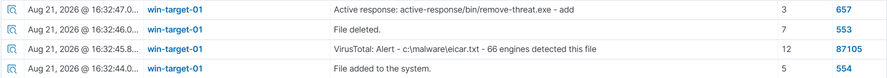

# Automated Malware Detection & Removal via FIM + VirusTotal + Active Response

## Summary

This lab demonstrates a fully automated detection-to-remediation pipeline built on Wazuh: File Integrity Monitoring (FIM) detects a new file, its hash is checked against VirusTotal's threat intelligence, and a positive detection automatically triggers an Active Response that removes the file, all without analyst intervention. The full cycle, from file introduction to confirmed deletion, completes in under two seconds.

## Lab Environment

| **Component** | **OS** | Role |
| --- | --- | --- |
| Wazuh Manager | Ubuntu Server 24.04 LTS | Log analysis, VirusTotal integration, active response engine |
| Target Endpoint | Windows 11 Enterprise Evaluation, RDP enabled | FIM monitoring, active response execution |

## Environtment Setup

Install Python and PyInstaller on the target endpoint. PyInstaller is required because Wazuh's active response on Windows cannot execute `.py` files directly. The response script must be compiled into a standalone `.exe`.

Compile `remove-threat.py` into an executable using `pyinstaller -F remove-threat.py`, then move the resulting `.exe` from `dist/` into `active-response/bin/`, where Wazuh expects response binaries to live.

## **Integration Configuration**

On the Wazuh Manager, the VirusTotal integration is enabled in `ossec.conf`:

```jsx
<integration>
  <name>virustotal</name>
  <api_key>YOUR_API_KEY</api_key>
  <group>syscheck</group>
  <alert_format>json</alert_format>
</integration>
```

This forwards file hashes captured by the agent's FIM module to the VirusTotal API for reputation lookup. The active response is then bound to trigger on a positive detection:

```jsx
<command>
  <name>remove-threat</name>
  <executable>remove-threat.exe</executable>
  <timeout_allowed>no</timeout_allowed>
</command>

<active-response>
  <disabled>no</disabled>
  <command>remove-threat</command>
  <location>local</location>
  <rules_id>87105</rules_id>
</active-response>
```

## **Attack Simulation**

An [EICAR test file](https://www.eicar.org/download-anti-malware-testfile/), an industry-standard, harmless string used to safely validate antivirus/EDR pipelines without deploying real malware, it was placed at `c:\malware\eicar.txt` on the target endpoint, inside a directory monitored by FIM.

## Detection Query

```jsx
[rule.id](http://rule.id/):(87105 OR 553 OR 657)
```

1. **VirusTotal Alert (Rule ID 87105)**
FIM detects the new file and forwards its hash to VirusTotal. 66 engines flag `eicar.txt` as malicious, and Wazuh raises a high-severity alert.
2. **File Deleted (Rule ID 553)**
FIM confirms the file no longer exists on disk, one second after the VirusTotal alert.
3. **Active Response Executed (Rule ID 657)**


These events fire in sequence within roughly two seconds (detection, remediation, and confirmation) with `active-response/bin/remove-threat.exe` shown as the action that ran, verifying the response pipeline executed exactly as configured without any manual intervention.

## **MITRE ATT&CK Mapping**

| ID | Name | Triggered By |
| --- | --- | --- |
| T1203 | Exploitation for Client Execution | VirusTotal Alert (Rule 87105) |
| T1070.004 | Indicator Removal: File Deletion | File deletion (Rule 553) |
| T1485 | Data Destruction | File deletion (Rule 553) |

## **Remediation**

- File was removed automatically by active response; no manual cleanup required in this simulation.
- Verify VirusTotal API rate limits (4 req/min on free tier) are sufficient for the endpoint's expected file-change volume before relying on this in a larger environment.
- Consider adding a quarantine step (move-then-delete) rather than immediate deletion, so false positives can be recovered.
- Review `active-responses.log` on the agent periodically to confirm the response binary continues executing as expected after Wazuh or Windows updates.
- Extend testing beyond EICAR with a wider set of benign-but-flagged test artifacts to validate hash-based detection consistency.

## Conclusion

This exercise validated an end-to-end automated remediation pipeline using Wazuh: from file introduction, through FIM detection, VirusTotal reputation lookup, and active response execution, all without analyst involvement. The full cycle from detection to confirmed removal completed in under two seconds. Beyond demonstrating detection, this shows Wazuh's capability as an orchestration layer that can act on threat intelligence in real time, closing the gap between "alert generated" and "threat remediated" that traditionally requires manual SOC analyst action.